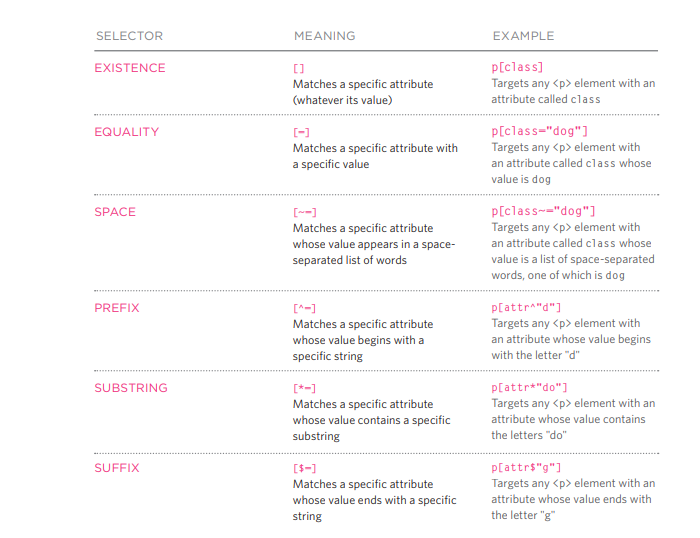

# HTML Images; CSS Color & Text

## Images :   

You can add images into your page by using **< img>** element, with the **"src"** that tells the browser where it can find the image file. Also add  **"alt"** to give a text description of the image.  

You can specify the size of the image by adding **"height"** and **"width"**. attributes. and the place of the image by using **"align"** attribute, wether you want it at left or right or top or middle or bottom.  

**3 tips should be followed we creating images for your website:**  
 - Save images in the right format. [ It is better to be "JPEG for the colorful iamges"
- Save images at the right size. [ you can use "Adope photoshop" to have the image in correct shape]
- Use the correct resolution. [Images should be saved at a resoltution of 72 ppi. The higher the resolution, the larger the size of the file.
-  for the images dimensions, it is better to save the image with the same width and height that you want them to appear on the page.
 

**Vector images :**  
They are resolution- independent, they are created by placing points on a grid.  

You can add captions to the images by using **< figure> and < figcaption>**  element. 
.....................................................................................................................................................   
## COLORS
**You can specify any color in CSS in one of three ways :**
- RGB values :
- hex codes :
- color names :
.....................................................................................................................................................   
**Background-color :**  
You can specify your choice of background color in the same three ways you can specify foreground colors: **RGB values, hex codes, and color names.**  
.....................................................................................................................................................   
**Understanding Color:**  
Every color on a computer screen is created by mixing amounts of red, green, and blue. To find the color you want, you can use a color picker.  
.....................................................................................................................................................   
**Contrast :**  
- **Low-contrast :** Text is harder to read when there is low contrast.  
- **High-contrast :** Text is easier to read when there is higher contrast.  
- **Medium-contrast :** reducing the contrast a little bit improves readability.  
.....................................................................................................................................................   
**Opacity:**  
The transparency of the color.  
.....................................................................................................................................................   
**HSL & HSLA:**  
HSL stands for; hue, saturation, and lightness.  
HSLA stands for; hue, saturation, lightness, and alpha.  
.....................................................................................................................................................   

## Text :  

**There are many types of fonts for the text. such as ;**  

**Font-family :** Serif , Sans-Serif, Monospace.  

You can control the wight and style and stretch of the text.  

**[ Weight]** ; Light, Medium,Bold, Black.  
**[ Style]** ; Normal, Italic, Oblique.  
**[ Stretch]** ; Condensed, Regular, Stretch.  
**Font size** : [ Pixels, Percentages,EMS].  
The default size of the text in a browser is 16 pixels.  
**Font-face** : [ it allows you to use a font, even if it is not installed on the computer of the person browsing, by allowing you to specify a path to a copy of the font ]  
**Font-weight** : [ Normal, Bold ]  
**Font-style** : [ Normal, Italic, Oblique].  
**Text-transform** : [uppercase, lowercase, capitalize], it changes the case of the text.  
**Text-decoration** : [none, undrline, overline, line-through, blink].   
**Line-height:** [ [ Pixels, Percentages,EMS].  
**Letter-spacing** : [ [ Pixels, Percentages,EMS]. it is the space between each letter.  
**Word-spacing**: it is the space between each word.  
**Text-align** : [left, right, center, justify(take full width]. the control of the position of the text.  
**vertical-align** ; [ allow you to vertically align text in the middle of block-level elements].  
**Text-indent** : [ allows you to indent the first line of text within an element.]  
**Text-shadow** : [ it control the amount of shadow in your text].  
**pseudo-elements** [:first-letter and:first-line ], You specify the pseudo-element at the end of the selector, and then specify the declarations as you would normally for any other element.  
**pseudo-classes** : [ :link , :visited ] , it allow you to set different styles for links.  
**pseudo-classes**: [: hover , : active ,  : focus ], it allows you to change the appearance of elements when a user is interacting with them.  

**Attribute Selectors :**  

  

